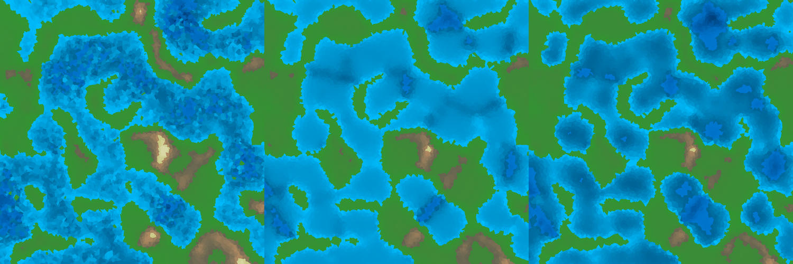
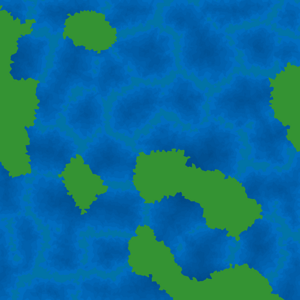

# w4rld

Génération procédurale de monde en Rust : maillage de Voronoï, plaques tectoniques, surrection et
subsidence, isostasie, érosion thermique, niveau de la mer, pluie avec effet orographique, érosion
hydraulique, et un GIF animé de toute l'évolution.


Projet du soir, écrit en deux jours (janvier 2026), pour pratiquer Rust sur un vrai sujet et retrouver
le plaisir des mondes générés à la Dwarf Fortress. Il est raconté sur [Binary Imothep](https://medium.com/binary-imothep),
série *Jeux & simulation* :

- **Épisode 1** — « Générer un monde en 2 254 lignes de Rust » : la version d'origine, avec ses défauts.
  Figée au tag [`blog/jeux-simulation-1`](../../tree/blog/jeux-simulation-1).
- **Épisode 2** — la réparation : ce que contient `main` aujourd'hui (voir « Ce qui a été corrigé »).

## Le pipeline

1. **Maillage** : N points aléatoires + 4 points fantômes lointains → Delaunay (`delaunator`) → cellules de Voronoï.
2. **Plaques** : graines espacées (maximisation de la distance minimale) → parcours en largeur à sources multiples. 60 % de plaques océaniques.
3. **Niveau de base et élévation initiale** : +0,1 sur les continents ; dans l'océan, un **profil de subsidence thermique** : −0,25 aux dorsales (frontières divergentes océan-océan), puis de plus en plus profond en racine carrée de la distance à la dorsale la plus proche, jusqu'à −0,75 en plaine abyssale.
4. **Tectonique** (40 cycles) : vitesse relative projetée sur la normale de chaque arête inter-plaques → compression (surrection diffuse, surrection de cœur continent-continent avec fatigue, subduction, affaissement) ou extension (dorsale, rift). Deltas diffusés puis appliqués, **relaxation** vers le niveau de base (elle tient lieu d'érosion à grande échelle et fait saturer le relief), **suspendue dans les fosses en subsidence active** (topographie dynamique), plancher à −1,8, 3 passes d'érosion thermique.
5. **Niveau de la mer** : quantile pour obtenir 40 % de terres émergées.
6. **Pluie et érosion hydraulique** (40 cycles) : distance à l'océan, humidité exponentielle, bonus orographique (vent ouest → est), écoulement vers le plus bas voisin, érosion des terres émergées et dépôt.
7. **GIF** : une image par étape, légende en police bitmap 5 × 7 maison.

Tous les paramètres sont dans [`world_gen/src/params.rs`](world_gen/src/params.rs) ; le pipeline est dans
[`world_gen/src/pipeline.rs`](world_gen/src/pipeline.rs) et se simule sans dessiner.

## Lancer

```bash
cargo build --release
./target/release/world_gen --seed 2026            # sorties dans out/
./target/release/world_gen --seed 2026 --legacy --out out-legacy   # les défauts de l'épisode 1, même monde
./target/release/world_gen --seed 2026 --flat-ocean --out out-plat # version intermédiaire : mer uniforme
./target/release/world_gen --no-images            # simulation seule, pour mesurer
./target/release/world_gen --help
```

Même seed = même monde : le programme imprime une **empreinte** (FNV-1a des élévations finales) qui doit
être identique d'une exécution à l'autre. Sorties : 85 PNG, `world_evolution.gif` (~16 Mo), `stats.csv`
(une ligne par cycle : min, max, moyenne, écart-type, arêtes convergentes et divergentes, arêtes
d'orogenèse de cœur, coins à 0,0, coins sous l'eau, ratio de terres, écart-type du fond marin).

Sur un portable, en release, 10 000 cellules : **simulation 0,4 s**, rendu des PNG 4 s, GIF 12 s, soit
17 s au total. La version de l'épisode 1 mettait 97 s, dont 98 % dans la quantification des couleurs du GIF.

## Tests

```bash
cargo test --release
```

Dix tests d'intégration verrouillent les défauts de l'épisode 1 et les choix de l'épisode 2 : même seed →
même empreinte ; seeds différents → mondes différents ; le niveau de la mer donne bien 40 % de terres ;
l'érosion ne remonte jamais le fond marin (et le fait en mode `legacy`) ; chaque plaque est connexe ;
l'orogenèse de cœur se déclenche puis s'éteint (et ne se déclenche jamais en mode `legacy`) ; le relief
sature avec la relaxation (et continue de monter sans) ; le fond marin a plus de relief et des fosses plus
profondes qu'avec un fond plat ; les fosses respectent le plancher.

## Ce qui a été corrigé (épisode 2)

Même monde (seed 2026). De gauche à droite : la version de l'épisode 1 (`--legacy`), la version
intermédiaire à fond océanique plat (`--flat-ocean`), la version actuelle.



1. **Seed et empreinte.** `thread_rng` remplacé par un `StdRng` injecté dans le maillage et les plaques ;
   empreinte FNV-1a des élévations finales imprimée et testée. Sans cela, aucune comparaison n'était possible.
2. **L'orogenèse de cœur se déclenche.** Le seuil de compression est une fraction de la compression
   maximale possible (0,55 × 0,5 = 0,275) au lieu d'un absolu de 0,55 inatteignable. Le critère
   « continental » combine la nature de la plaque et l'élévation : sur l'élévation seule, des cellules
   océaniques soulevées par diffusion passaient pour des continents et l'orogenèse ne s'éteignait jamais.
   Mesuré : 8 arêtes actives pendant 16 cycles, puis 0.
3. **Le relief sature.** Relaxation `−k (h − base)` par cycle, k = 0,06 : sur les continents, elle tient
   lieu d'érosion à grande échelle. L'altitude maximale culmine vers le cycle 12 puis redescend quand
   l'orogenèse s'éteint ; sans relaxation elle montait encore au cycle 40 (2,24), seulement freinée par
   l'érosion thermique.
4. **L'érosion ne remonte plus le fond marin.** L'érosion fluviale ignore les coins immergés. Avant :
   3 311 coins exactement à 0,0 après la pluie et 8 461 sous l'eau ; après : 0 et 12 003.
5. **Le fond marin a un profil.** La première version de la relaxation ramenait tout l'océan vers −0,5 :
   la mer était devenue uniforme (écart-type 0,073, profondeur minimale −0,56). Le niveau de base
   océanique suit désormais la subsidence thermique, haut à la dorsale, bas en plaine abyssale
   (écart-type 0,107).

   
6. **Les fosses existent.** Une fosse est de la topographie dynamique, maintenue par la plaque qui plonge :
   la relaxation est suspendue dans les cellules océaniques en subsidence active, proportionnellement au
   forçage, avec un plancher à −1,8. Profondeur minimale : −0,86 contre −0,56 avec la relaxation partout.
7. **Le GIF en 12 s au lieu de 98.** `Frame::from_rgba` quantifie la palette à la vitesse 1 ; à 10, la
   différence est invisible sur ces rendus. La simulation elle-même tient en 0,4 s.
8. Nettoyage : crate `world_core` vide supprimée, champs et fonction morts retirés, boucle dupliquée
   dans la pluie retirée, sorties dans `out/`, rendu couleur par défaut, zéro avertissement.

Le mode `--legacy` conserve volontairement les défauts 2 à 4 et le mode `--flat-ocean` la version
intermédiaire, pour pouvoir les mesurer sur le même monde. L'empreinte n'est comparable qu'entre
exécutions du même code : une réécriture arithmétiquement équivalente peut la changer au dernier bit.

## Note sur la fabrication

Ce code a été écrit avec un assistant IA, sous ma direction : je relis, je corrige, je demande des
modifications, mais je laisse l'IA produire le gros du travail. C'est ce qui me permet d'aller vite et
d'essayer des choses nouvelles, ce que j'adore faire. Les articles qui décrivent ce dépôt sont publiés sur
[Binary Imothep](https://medium.com/binary-imothep) avec la même note.

## Licence

MIT, voir [`LICENSE`](LICENSE).
