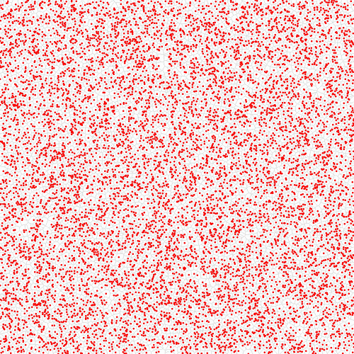
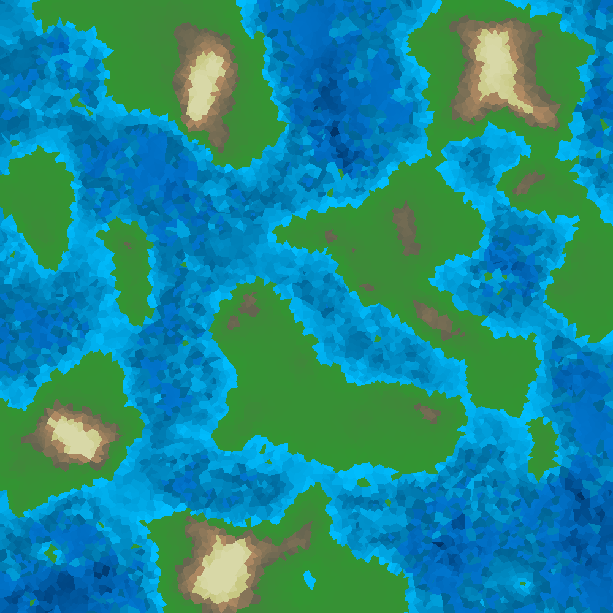

# w4rld

Génération procédurale de monde en Rust : maillage de Voronoï, plaques tectoniques, surrection et
subsidence, érosion thermique, niveau de la mer, pluie avec effet orographique, érosion hydraulique,
et un GIF animé de toute l'évolution.



Projet du soir, écrit en deux jours (janvier 2026), pour pratiquer Rust sur un vrai sujet et retrouver le plaisir des mondes générés à la Dwarf Fortress. Il est raconté dans l'article
**« Générer un monde en 2 254 lignes de Rust »** sur [Binary Imothep](https://medium.com/binary-imothep)
(série *Jeux & simulation*, épisode 1). Le tag [`blog/jeux-simulation-1`](../../tree/blog/jeux-simulation-1)
fige la version décrite dans l'article, **défauts compris** (voir plus bas).

## Le pipeline

1. **Maillage** : 10 000 points aléatoires + 4 points fantômes lointains → Delaunay (`delaunator`) → cellules de Voronoï.
2. **Plaques** : 50 graines espacées (maximisation de la distance minimale) → parcours en largeur à sources multiples. 60 % de plaques océaniques.
3. **Élévation de base** : −0,5 (océan) / +0,1 (continent).
4. **Tectonique** (40 cycles) : vitesse relative projetée sur la normale de chaque arête inter-plaques → compression (surrection, subduction, affaissement) ou extension (dorsale, rift). Deltas diffusés puis appliqués. 3 passes d'érosion thermique par cycle.
5. **Niveau de la mer** : quantile pour obtenir 40 % de terres émergées.
6. **Pluie et érosion hydraulique** (40 cycles) : distance à l'océan par parcours en largeur, humidité exponentielle, bonus orographique (vent ouest → est), écoulement vers le plus bas voisin, érosion et dépôt.
7. **GIF** : une image par étape, légende en police bitmap 5 × 7 maison.

Tous les paramètres sont dans [`world_gen/src/params.rs`](world_gen/src/params.rs).

## Lancer

```bash
cargo build --release
cd world_gen && ../target/release/world_gen
```

Sur un portable : ~37 s de compilation, ~97 s d'exécution, ~100 Mo de mémoire. Sortie dans le dossier
courant : `step1_mesh.png`, `step2_plates.png`, `step3_base_elevation.png`, `step4_tectonic_cycle_XX.png`
(40), `step5_after_sea_level.png`, `step6_hydraulic_cycle_XX.png` (40), `step7_final_world.png`, et
`world_evolution.gif` (85 images, ~16 Mo).

Le générateur n'a **pas de seed** : chaque exécution produit un monde différent.

Le rendu par défaut est en niveaux de gris avec un liseré bleu sur les côtes (mode debug). Pour le rendu
couleur des images ci-dessus, passer `debug_grayscale` à `false` dans `params.rs`.



## État connu de cette version

Quatre défauts, tous vérifiés en relançant le programme et détaillés dans l'article :

1. **L'équilibrage des plaques a été supprimé** : il cassait la connexité des plaques (commentaire dans `tectonics.rs`).
2. **La surrection orogénique « de cœur » ne se déclenche jamais** : la vitesse relative maximale de deux plaques est 0,5 (`plate_speed_max` × 2) et `compression_threshold` vaut 0,55. Le log affiche `core_edges=0` à chaque cycle. Toute la mécanique de fatigue et d'âge d'orogenèse est du code mort avec ces paramètres.
3. **Les deltas tectoniques sont identiques à chaque cycle** (vitesses constantes, plaques fixes, aucune dépendance à l'état) : la ligne `Deltas:` du log ne change pas du cycle 1 au cycle 40. Les 40 cycles équivalent à un cycle multiplié par 40, à l'érosion thermique près.
4. **L'érosion hydraulique remonte le fond marin au niveau de la mer** : dans `erode()`, le plafond `corner_elevation * 0.1` est négatif sous l'eau, l'érosion devient négative et le `.max(0.0)` bloque le coin exactement à 0,0. Mesuré : 0 coin à 0,0 avant la pluie, 3 327 après (sur 20 002).

Pour reproduire la mesure du point 4, insérer ce bloc dans `main.rs` avant et après la boucle
d'érosion hydraulique :

```rust
let zero = graph.corners.iter().filter(|c| c.elevation == 0.0).count();
let neg  = graph.corners.iter().filter(|c| c.elevation < 0.0).count();
println!("coins à 0.0 = {}  sous l'eau = {}  total = {}", zero, neg, graph.corners.len());
```

## Note sur la fabrication

Ce code a été écrit avec un assistant IA, sous ma direction : je relis, je corrige, je demande des
modifications, mais je laisse l'IA produire le gros du travail. C'est ce qui me permet d'aller vite et
d'essayer des choses nouvelles, ce que j'adore faire. L'article qui décrit ce dépôt est publié sur
[Binary Imothep](https://medium.com/binary-imothep) avec la même note.

## Licence

MIT, voir [`LICENSE`](LICENSE).
